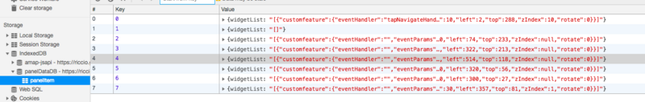
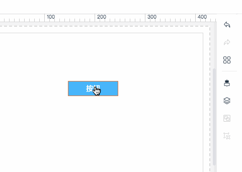

> 在web应用中，用户在进行一些富交互行为的操作时难免会出现误操作，比如在富文本编辑器设置错了字体颜色就需要撤回，做H5活动页面的时候不小心删了一个图片也需要撤回，更比如在线设计原型图应用的时候不小心删了一个页面等，总之在交互场景非常复杂的情况下，用户操作失误的可能性非常大，这时候‘撤销’和‘前进’这两个操作就很有必要了，而且用户体验也很好

## 思路 ##

不管是任何场景下的web应用，用户的每一次操作我们都可以看成是对某个组件或某个对象的状态和属性进行改变，一旦连续的动作操作完成正准备进行下一个动作之前，此刻的状态就是一个全新的状态

> A —— B —— C
用户未操作的时候全局状态是A
用户操作某个组件使其移动到位置X，松开鼠标之后全局状态是B
用户操作另一个组件使其删除，完成后全局状态是C

所以，撤销的操作就是在用户操作状态到C的时候让全局的状态回到B，回到上一次操作完的时候。
那么就需要可以存放这种大量状态的列表或索引来记录每一次操作的动作

但如果我用某一个数组变量来存储如此庞大的数据是不是略显不妥？数据量越大内存应该会爆吧？所以这里我推荐大家使用IndexedDB
下面是利用Angular、Rxjs和IndexedDB封装好的一个服务类

``` javascript
import { Inject } from "@angular/core";
import { IndexedDBAngular } from "indexeddb-angular";
import { Subject, Observer, Observable } from "rxjs";

export interface IDBData {
	widgetList: string
}

// 前进和后退的服务
@Inject({
	providedIn: 'root'
})
export class PanelExtendMoveBackService {

	/**
	 * 发射DB集合存储的数据，可订阅
	 */
	public launchDBDataValue$: Subject<IDBData> = new Subject<IDBData>()

	/**
	 * 创建一个叫panelDataDB的本地数据库，版本号为1
	 */
	public db = new IndexedDBAngular('panelDataDB', 1)

	/**
	 * 记录前进和后退的存储集合项的下标key
	 * 默认为0
	 */
	public dbCurrentIndex: number = 0

	/**
	 * 自增的DBkey
	 */
	public dbKey: number = -1

	// 是否允许前进
	public get isMove() : boolean {
		return this.dbCurrentIndex < this.dbKey
	}
	// 是否允许后退
	public get isBack() : boolean {
		return this.dbCurrentIndex > 0
	}

	constructor() {}

	/**
	 * 创建DB集合
	 */
	public createCollections(): Observable<boolean> {
		const _sub: Subject<boolean> = new Subject<boolean>()
		this.dbKey = -1
		this.db.createStore(1, (db: any) => {
			db.currentTarget.result.createObjectStore('panelItem')
		}).then(()=>{
			this.dbClear()
			_sub.next(true)
		})
		return _sub.asObservable()
	}

	/**
	 * 往集合里添加数据
	 * 同时把新添加的key赋值给dbCurrentIndex，
	 */
	public dbAdd(): void {
		this.handleDbCurrentRefreshDB();
		this.dbKey += 1;
        // 此处存储你要保存的数据
		const _widget_list = []
		this.db.add('panelItem', { widgetList: JSON.stringify(_widget_list) }, this.dbKey).then(
			_e => {
				if ((<Object>_e).hasOwnProperty('key')) {
					this.dbCurrentIndex = _e.key
				};
			},
			() => {
				this.dbKey -= 1
				throw new Error('添加panelItem集合失败')
			}
		)
	}

	/**
	 * 在执行添加数据集操作的时候判断dbCurrentIndex当前指引的下标是否低于dbKey
	 * 如果是说明执行了后退操作之后后续动作执行了dbAdd的操作，则清空dbCurrentIndex索引之后的数据重新添加
	 */
	public handleDbCurrentRefreshDB(): void {
		if (this.dbCurrentIndex < this.dbKey) {
			for (let i = this.dbCurrentIndex + 1; i <= this.dbKey; i++) {
				this.db.delete('panelItem', i).then(() => {})
			}
			this.dbKey = this.dbCurrentIndex
		}
	}

	/**
	 * 执行后退操作发射DB数据集
	 */
	public acquireBackDBData(): void {
		if( this.isBack ) {
			this.dbCurrentIndex -= 1
			this.db.getByKey('panelItem', this.dbCurrentIndex).then(res=>{
				this.launchDBDataValue$.next(res)
			},()=>{ })
		}
	}

	/**
	 * 执行前进操作发射DB数据集
	 */
	public acquireMoveDBData(): void {
		if( this.isMove ) {
			this.dbCurrentIndex += 1
			this.db.getByKey('panelItem', this.dbCurrentIndex).then(res => {
				this.launchDBDataValue$.next(res)
			}, () => { })
		}
	}

	/**
	 * 清除DB集合panelItem
	 */
	public dbClear(): void {
		this.db.clear('panelItem').then(_e => {})
	}
}

```

这里我偷懒了一下，直接采用自增的id作为key了，也方便查找
每一次操作所存储的数据如下



最后可以看一下我实现好了的撤销和前进操作的场景





