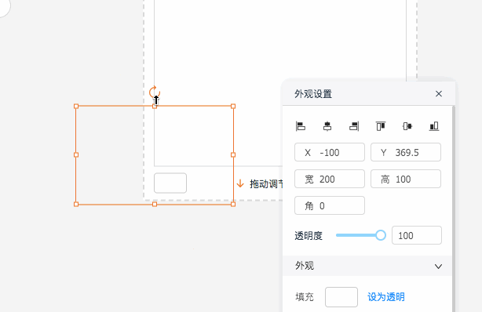
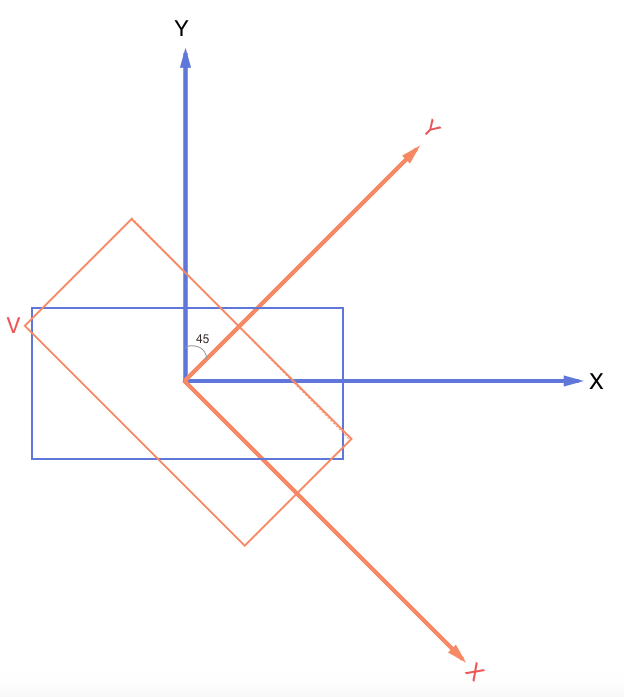
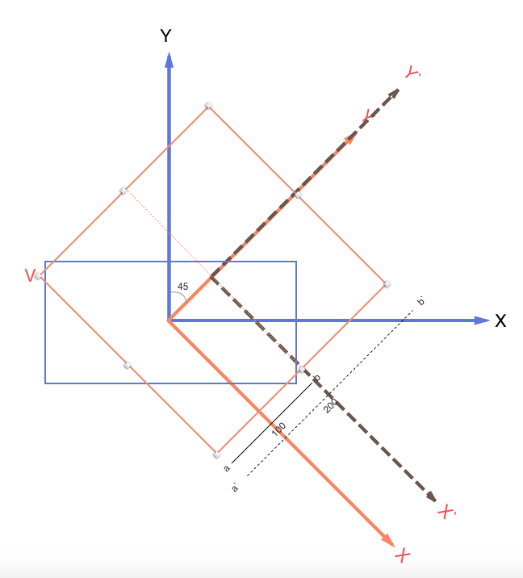
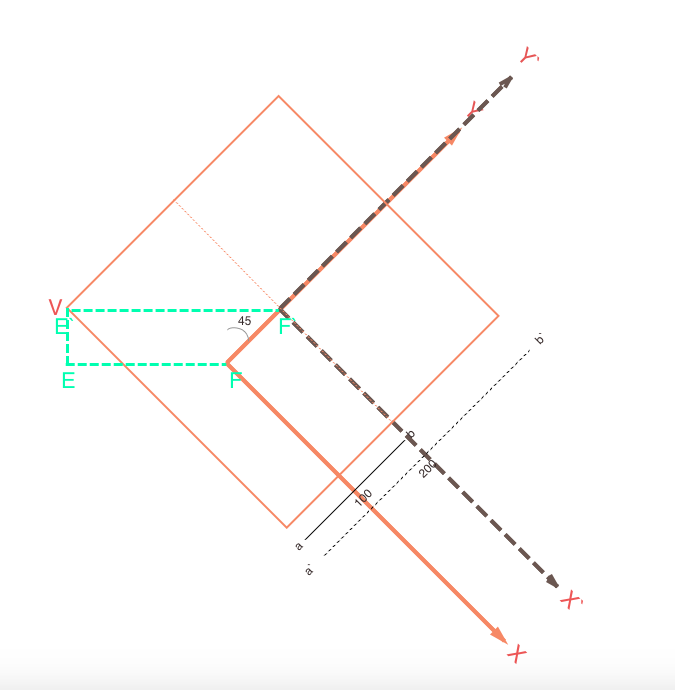
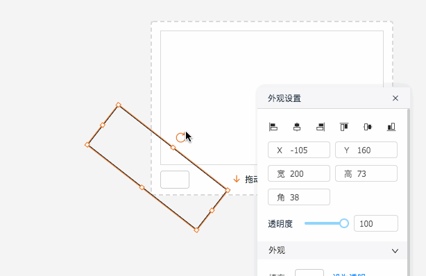

最近在写个人项目的时候遇到了拖拽拉伸加旋转组件然后改变其高度宽度的需求，原本以为‘拖拽那么简单，拉伸的话就改变width和height就好了’，因为拖拽拉伸的方位有八个点，所有一个个计算总会解决的，but

## 神奇的现象##

起初在没有加上旋转角度的时候测试了八个方位的拖拽拉伸是没有问题的，而且其本身实现方法不难，例如拖拽的是最顶部的中心点则改变其组件的top数值和height数值就好了，但如果加上了旋转角度之后、、似乎变得诡异了起来

## 分析原因 ##

我们知道，旋转的角度可以通过CSS3的transform属性的rotate值来改变，然后如果不改变坐标圆点则默认是组件的中心点，所以如果一旦rotate值发生改变其组件的整个坐标系也随之改变，我大概粗略的画了下图

图中蓝色的方块比作组件，其坐标系是蓝色的XY坐标系，加入旋转角度为45度的话，则坐标系就变成了橙色的XY坐标系

这个时候如果再用以蓝色坐标系为参考系来计算拖拽拉伸的数值肯定是不正确的，此时我们借助于坐标系的旋转变换公式，还记得吗？

## 理清需求 ##

因为我们在拉伸顶部的时候只计算了top值和height值，忽略了left值，以为拉伸顶部只改变只两个值就好了，但其实这是理想情况，譬如上图中的点V，我们在旋转到45度的时候，拉伸顶部要保证V点的位置不变，注意！只是保证V点在蓝色的原始坐标系中的位置，那么势必还是要计算left值的，我又大概粗略的画了下图

为了好计算，我假设组件的高度为100，被拉伸之后的高度为200，那么拉伸到200的时候其坐标系为深灰色的X\`Y\`坐标系，答案显而易见，V点到深灰色坐标原点的横坐标距离 等于 V点到橙色坐标原点的横坐标距离 加上 这两个坐标原点的横坐标距离

我最后大概又画了下图

也就是说我们在拖拽拉伸的时候要保证这个等式成立，也就是E\`F\` = EF + OO\`
那么，一我们知道了角度rotate、二我们也知道了两个坐标系圆点之间的距离OO\`(注:sin(45度) * (200 - 100) / 2)，那么就能保证V点的位置横向不变了，这里只例举了横坐标的情况，纵坐标的原理类似

## 最终效果 ##

