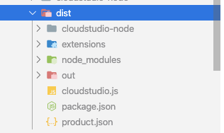
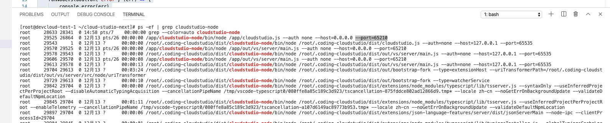

# 背景

事情的起因是这样，由于特殊需求需要在我们 webide 上增加水印背景图效果，用于`震慑`作用，（😊），起初是打算用插件的形式来实现，原理是直接修改 vscode 对应 css 文件里的样式，增加背景图属性，但最新版本的 vscode 似乎在后台进行了文件更改检查，导致直接修改 css 文件无效，👇

> 

可能是害怕用户把文件改坏了导致起不来了吧。。
但办法还是有的，vscode 的文件加载顺序流程是先从你 `/{源目录}/Content/Resources/app/out/vs/code/electron-browser/workbench/workbench.html` 开始加载的，里面只有一个 js 文件，就是负责用于 load 其他文件加载，那么如果我直接在这个 html 文件下直接添加 style 标签强制修改样式是否可行呢？答案是可以的，因为是在 vscode 执行文件更改检测之前就把 html 文件改了

# 水印插件

有了思路之后剩下的就交给 code

做的事情很简单，就是在 `workbench.html` 文件下增加 style 标签代码
``` CSS
.monaco-editor::before,
.monaco-editor-background::before,
.monaco-editor .inputarea.ime-input::before {
    content: " ";
    background-image: url(${base64代码}) !important;
    width: 100%;
    height: 1000vh;
    position: absolute;
    background-position: center;
    transform-origin: 0;
    transform: rotate(-20deg);
    opacity: 0.04;
    z-index: 1;
    pointer-events: none;
}
```

这里背景图采用 base64 是为了保证图片不落地，每次打开都是需要重新生成的;

然后根据名字生成水印图片是用了 [`text-to-svg`](https://github.com/shrhdk/text-to-svg) 这个库

生成代码如下

```Typescript
// @ts-ignore
import * as TextToSVG from 'text-to-svg';

const textToSVG = TextToSVG.loadSync();

import * as fs from 'fs';
import * as path from 'path';
import { logger } from './logger';

const dirName = __dirname;

const toBase64 = (file: fs.PathLike) => {
	var bitmap = fs.readFileSync(file);
	return new Buffer(bitmap).toString('base64');
};

export const generateWaterMark = (text: string): Promise<string> => {
	text = text.split(' ').join('');
	const pngName = `watermark.svg`;

	const pngPath = path.join(dirName, `./${pngName}`);

	logger.appendLine(`pngPath: ${pngPath}`);

	return new Promise((res, rej) => {
		const options = { x: 0, y: 0, fontSize: 32, anchor: 'top', attributes: { fill: '#ccc' } };

		const svgPath = textToSVG.getPath(text, options);
		const metrics = textToSVG.getMetrics(text, options);

		const width = metrics.width || 0;

		const svgTemp = `<svg xmlns="http://www.w3.org/2000/svg" xmlns:xlink="http://www.w3.org/1999/xlink" width="${width +
			100}" height="128">${svgPath}</svg>`;

		fs.writeFile(pngPath, svgTemp, {}, (err: Error) => {
			if (err) {
				logger.appendLine(err.toString());
				return;
			}
			res(toBase64(pngPath));
			if (fs.existsSync(pngPath)) {
				fs.unlinkSync(pngPath);
			}
		});
	});
};
```

通过实验在本地机器上确实是可行的，美滋滋，然后我们变把它打包出来放在 CS 上试试，结果却被提示 `workbench.htlm` 文件路径找不到！

检查一看 `vscode.env.appRoot` 方法返回的确实是一段不存在的路径；

我们通过进程发现原来在容器里运行的 webide 主进程是一个二进制文件，里面构造的虚拟目录当然是访问不了外面的真实目录的。。。

这个问题貌似也会发现在其他插件里，譬如最基本的 git 插件，它是需要访问到项目代码里的真实目录的，但如果是采用二进制文件运行则会报错，为此经过商榷我们不如将其改为 node 进程启动 webide 主进程

# 改造 binary 方式

实现思路很简单, 有如下几个步骤

> 先 clone 对应版本的 vscode 项目 ——> 打补丁 patch 魔改部分 ——> 执行 build 编译 ——> 编译内置插件 ——> 提取编译后的 out 目录和需要的两个 json 文件与内置插件目录 ——> 从腾讯云 COS 把对应版本的 node 模块复制进来 ——> 复制 cloudstudio.js 启动脚本文件进来 ——> 创建 dist 目录，把上述文件复制进来 ——> 打成 Tar 格式包文件复制到启动目录

改造的 binary 方法如下

```Typescript
private async binary(vscodeSourcePath: string, binariesPath: string, finalBuildPath: string): Promise<void> {
    const nodeTarName = 'node-v10.15.1-linux-x64-no-outside-dir.tar.gz';
    const nodeName = "cloudstudio-node";
    const cosUrl = `...`; // 固定版本 node 模块下载地址
    const tmpPath = os.tmpdir();
    const csJs = "cloudstudio.js";
    const distPath = path.join(finalBuildPath, "dist");
    this.log("[vscodeSourcePath]: " + vscodeSourcePath);
    this.log("[binariesPath]: " + binariesPath);
    this.log("[finalBuildPath]: " + finalBuildPath);
    await this.task("Dowload node V10.15.1 for COS", async () => {
        await util.promisify(cp.exec)(`curl ${cosUrl} -o ${nodeTarName}`, { cwd: tmpPath })
    })

    await this.task(`Extar ${nodeTarName}`, async () => {
        if (!fs.existsSync(path.join(finalBuildPath, nodeName))) fs.mkdirSync(path.join(finalBuildPath, nodeName));
        await util.promisify(cp.exec)(`tar zxvf ${path.join(tmpPath, nodeTarName)} -C ${nodeName}/ >/dev/null 2>&1`, { cwd: finalBuildPath });
    })

    await this.task(`Copy cloudstudio.js`, async () => {
        await util.promisify(cp.exec)(`cp ${path.join(__dirname, "cloudstudio.js")} ${finalBuildPath}`)
    })

    await this.task(`Create Dist`, async () => {
        const distLs = [nodeName, 'node_modules', 'package.json', 'product.json', 'out', 'extensions', csJs];

        fs.removeSync(distPath);
        fs.mkdirSync(distPath);

        for(const e of distLs) {
            await util.promisify(cp.exec)(`cp -rf ${e} dist/`, { cwd: finalBuildPath });
            if (e === "out") {
                await fs.copy(path.join(finalBuildPath, "out/vs/server/src/browser/workbench-build.html"), path.join(finalBuildPath, "out/vs/server/src/browser/workbench.html"));
            }
        };
    })

    await this.task(`Tar Dist`, async () => {
        await util.promisify(cp.exec)(`tar zcvf dist.tar.gz dist >/dev/null 2>&1`, { cwd: finalBuildPath });
        await util.promisify(cp.exec)(`cp dist.tar.gz ${binariesPath}`, { cwd: finalBuildPath })
    })
}
```

修改下 ci.bash 令其执行完 docker-exec build 之后执行 docker-exec binary 即可 

最终生成的目录如下

> 

其中 `cloudstudio-node` 目录就是下载固定版本的 node 模块，启动的时候为了防止用户的云主机可能没有安装 node 或没有对应的固定版本 node 则采用该方式。`cloudstudio.js` 的执行则更简单，只需启动 `out` 目录里的 out/vs/server/main.js 文件即可

``` Typescript
const cp = require("child_process");
const spawn = cp.spawn;
const process = require("process");

const dirName = __dirname;

const run = () => {
	const argv = process.argv.slice(2);
	const runNode = spawn(`${dirName}/cloudstudio-node/bin/node`, [`${dirName}/out/vs/server/main.js`, ...argv]);
	runNode.stdout.on("data", (data) => {
		console.log(data.toString())
	})
	runNode.stdout.on("error", (err) => {
		console.error(err)
	})
}

run()
```

然后我们修改 `supervisord.conf` 启动配置即可 `/app/cloudstudio-node/bin/node /app/cloudstudio.js --auth none --host=0.0.0.0 --port=65210`

我们通过命令查看到确实是通过 node 启动的

> 

这下不仅解决水印问题，连文件目录读取也解决，一切看起来还是那么美好
