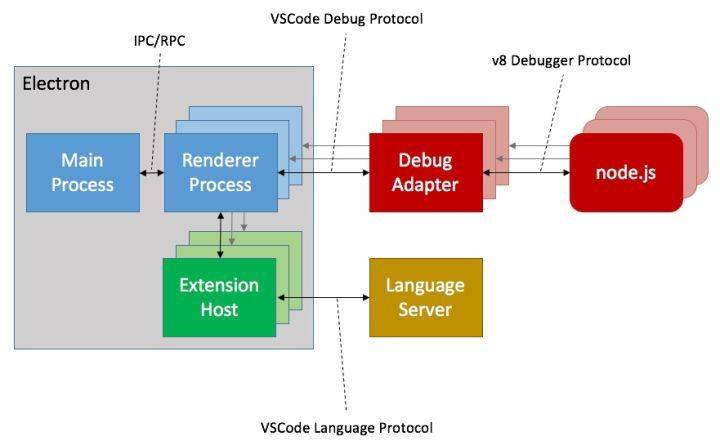
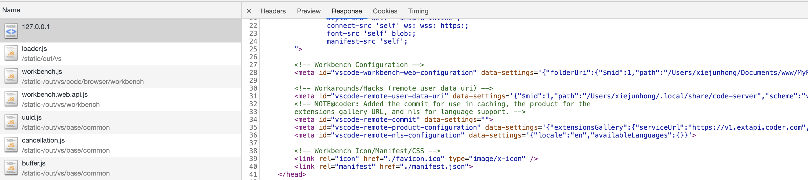
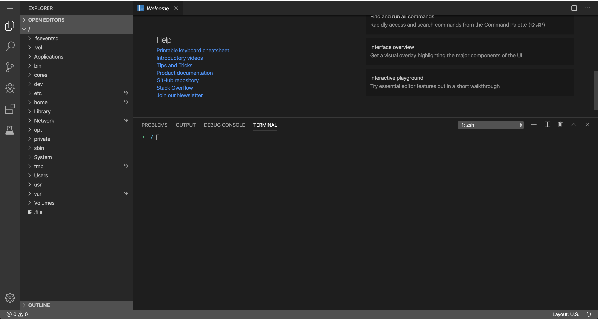

[code-server](https://github.com/cdr/code-server/tree/2.1692-vsc1.39.2) 是一个开源的在线 vscode 远端运行服务，本文从源码角度来解读他是如何把 vscode 搬到浏览器运行的

> vscode 版本 1.39.2 </br>
> node 版本 10.16.0

### 先预热一下 vscode 架构



作为本地的 `Electron` 应用，他采用的是多进程架构;

主进程和很多子进程之间进行 `IPC` 通信或 `RPC` 远程过程调用，其中插件系统也作为了一个进程，所有的插件都会在这个进程下运行，包括语言服务协议等;

`debug` 协议与其他进程不同，每次执行 `debug` 都会新开一个子进程;

其中较为常见的文件读写都是在 `main` 主进程中完成;

### coder 开发流程

在 coder-server 的 README 里有开发流程步骤，大抵上分为

```shell
git clone https://github.com/microsoft/vscode
cd vscode
git checkout ${vscodeVersion} # See travis.yml for the version to use.
yarn
git clone https://github.com/cdr/code-server src/vs/server
cd src/vs/server
yarn
yarn patch:apply
yarn watch
# Wait for the initial compilation to complete (it will say "Finished compilation").
# Run the next command in another shell.
yarn start
# Visit http://localhost:8080
```

1. 先 `clone` vscode 项目并切换到某固定版本
2. 把自己 `clone` 到 `src/vs/server` 目录下
3. 把魔改的部分通过补丁 `patch` 打进 `vscode，执行` `watch` 将 `vscode` 项目里的 ts 代码编译成可执行的 js 文件并输出到 `out` 目录
4. start 其实就是用 node 跑 out/vs/server/main.js 文件

所以我们可以认为他完全是充当了 `vscode` 的 `server` 端，为其 web 版提供支持能力，重点就是在 `patch` 补丁部分

### 目录

```tree
scripts
├── build.ts                        // 主要的 build 脚本文件，分为 build、binary、package 和 ensure-in-vscode 四种 task
├── ci.bash                         // 用于跑 CI 构建流程，分为 docker-build 和 local-build
├── ci.dockerfile
├── optimize.js
├── package.json
├── product.json
├── tsconfig.json
└── vscode.patch                    // 针对 vscode 1.39.2 版本打的 git patch 文件
src
├── browser                         // 主要是 client 端的实现
│   ├── api.ts                      // vscode 客户端的 api 实现
│   ├── client.ts                   // 客户端初始化执行
│   ├── extHostNodeProxy.ts         // 插件代理，通过补丁打在了 src/vs/workbench/services/extensions/worker/extHost.services.ts 目录作为单例服务，进行 rpc 远程过程调用
│   ├── login.html                  // 登陆授权
│   ├── mainThreadNodeProxy.ts      // 主线程代理
│   ├── upload.ts                   // 上载服务，拖动文件在文件树就执行该服务
│   ├── workbench-build.html
│   ├── workbench.html              // 入口 html 文件
│   └── worker.ts                   // 复写 src/vs/workbench/api/worker/extHostExtensionService.ts 目录下 _loadCommonJSModule 方法，其中关键用到 coder 自己封装的 node-browser 和 requirefs，为浏览器提供诸如 fs、net、require 的能力
├── common                          // server 端和 client 端都可使用的服务
│   ├── nodeProxy.ts                // 代理隧道服务
│   ├── telemetry.ts                // 遥测隧道服务
│   └── util.ts
├── media
│   ├── code-server.png
│   ├── favicon.ico
│   ├── login.css
│   └── manifest.json
└── node                            // 服务端 server 实现
    ├── channel.ts                  // 主要
    ├── cli.ts
    ├── connection.ts               // 主要用于 ipc 通道连接
    ├── insights.ts
    ├── ipc.ts
    ├── marketplace.ts
    ├── nls.ts
    ├── protocol.ts                 // 主要是 websocket 的协议
    ├── server.ts
    ├── update.ts
    ├── uriTransformer.js
    └── util.ts
typings
├── api.d.ts    
├── httpolyglot.d.ts
└── package.json
```

### 启动顺序

在 `server` 目录下执行 `start` 命令其实就是用 `node` 跑 `out/vs/server/main.js` 文件

`main` 文件核心就一行

> require("../../bootstrap-amd").load("vs/server/src/node/cli");

通过 `amd` 模块加载 `cli` 文件，而这个 `cli` 文件就是位于 server/node/cli;

该文件执行 <span id="main">`main`</span> 函数
```typescript
const main = async(): Promise<boolean | void | void[]> => {
	const args = getArgs();
	if (process.env.LAUNCH_VSCODE) {
		await ipcMain.handshake();
		return startVscode(args);
	}
	return startCli(args) || new WrapperProcess(args).start();
};
```

这一步开始其实 `LAUNCH_VSCODE` 环境变量初始为空，`startCli` 函数其实里面也是根据环境变量参数做一些判断处理，但初始都为空，关键是这个 `WrapperProcess`;

实例化 `WrapperProcess` 的时候便开始进行 `ipc` 的握手，用于进程之间的通信，完了之后执行 `start` 函数

```typescript
if (!this.started) {
    const child = this.spawn();
    this.started = ipcMain.handshake(child).then(() => {
        child.once("exit", (code) => exit(code!));
    });
    this.process = child;
}
return this.started;
```

通过 `spawn` 创建子进程, 而其中 `spawn` 做了以下事情

```typescript
//...
const isBinary = (global as any).NBIN_LOADED;
return cp.spawn(process.argv[0], process.argv.slice(isBinary ? 2 : 1), {
    env: {
        ...process.env,
        LAUNCH_VSCODE: "true",
        NBIN_BYPASS: undefined,
        VSCODE_PARENT_PID: process.pid.toString(),
        NODE_OPTIONS: nodeOptions,
    },
    stdio: ["inherit", "inherit", "inherit", "ipc"],
});
```

> `NBIN_LOADED` 环境其实是 `coder` 自定义的，[nbin](https://github.com/cdr/nbin) 主要是通过给 `node` 的 `fs` 模块打补丁一顿魔改达到增强二进制编译的过程，这也是为啥会对 `node` 版本具有强约束性的原因（骚。。。

使用当前的所有参数重新创建了一个子进程并返回，其中 `stdio` 指定了 `ipc` `通道，LAUNCH_VSCODE` 环境变量也设置为了 true，此时 `main` 函数被 `重新执行` 了;

回到 <a href="#main">`main`</a> 这里, 此时直接等待 `ipc` 握手之后运行 `startVscode`;

```typescript
//...

const server = new MainServer({
    ...options,
    port: typeof args.port !== "undefined" ? parseInt(args.port, 10) : 8080,
    socket: args.socket,
}, args);

const [serverAddress, /* ignore */] = await Promise.all([
    server.listen(),
    unpackExecutables(),
]);

//...
```

可以总结为，`cli` 其实就是建立 `ipc` 通道并预处理一大堆参数从而启动 `server` 的过程;

### Server 端

来到 `server` 端的 `MainServer` 函数，它继承了抽象类 `Server`，并在构造函数里启动 `http` 服务

```typescript
public constructor(options: ServerOptions) {
    this.options = {
        host: options.auth === "password" && options.cert ? "0.0.0.0" : "localhost",
        ...options,
        basePath: options.basePath ? options.basePath.replace(/\/+$/, "") : "",
        password: options.password ? hash(options.password) : undefined,
    };
    this.protocol = this.options.cert ? "https" : "http";
    if (this.protocol === "https") {
        const httpolyglot = localRequire<typeof import("httpolyglot")>("httpolyglot/lib/index");
        this.server = httpolyglot.createServer({
            cert: this.options.cert && fs.readFileSync(this.options.cert),
            key: this.options.certKey && fs.readFileSync(this.options.certKey),
        }, this.onRequest);
    } else {
        this.server = http.createServer(this.onRequest);
    }
}
```

其中 `cert` 参数做了自签名证书处理，我猜测是为了安全考虑吧。。

`onRequest` 方法里对请求头做了预处理

```typescript
//...
const payload = await this.preHandleRequest(request, parsedUrl);
//...
```

`preHandleRequest` 方法里对请求的路径做了一通拦截处理，其中有一段

```typescript
// Allow for a versioned static endpoint. This lets us cache every static
// resource underneath the path based on the version without any work and
// without adding query parameters which have their own issues.
// REVIEW: Discuss whether this is the best option; this is sort of a quick
// hack almost to get caching in the meantime but it does work pretty well.
if (/^\/static-/.test(base)) {
    base = "/static";
}
```

通过正则匹配所有路径里开头含有 `static-` 的文件将 `base` 路径重置为 `/static` ，为了后面做缓存处理

```typescript
//...
case "/static":
    const response = await this.getResource(this.rootPath, requestPath);
    response.cache = true;
    return response;
//...
```

其中 `getResource` 就是直接读文件内容并返回

```typescript
protected async getResource(...parts: string[]): Promise<Response> {
    const filePath = this.ensureAuthorizedFilePath(...parts);
    return { content: await util.promisify(fs.readFile)(filePath), filePath };
}
```

除了 `static` 路径和特定的几个资源文件路径其余的文件都向下走 `handleRequest` 函数;

这里面就是处理各种文件资源请求的方式，譬如有对 `tar` 文件格式资源的处理和 `webview` 文件资源处理还有静态资源的处理等，当然里面还有 `heartbeat` 心跳;

对于根路径 `/` 返回的是 `getRoot` 函数

```typescript
case "/": return this.getRoot(request, parsedUrl);
```

`getRoot` 函数里对 `src/vs/server/src/browser/workbench.html` 做了一些文本替换处理；👇

```typescript
private async getRoot(request: http.IncomingMessage, parsedUrl: url.UrlWithParsedQuery): Promise<Response> {
    const filePath = path.join(this.serverRoot, "browser/workbench.html");
    let [content, startPath] = await Promise.all([
        util.promisify(fs.readFile)(filePath, "utf8"),
        this.getFirstValidPath([
            { path: parsedUrl.query.workspace, workspace: true },
            { path: parsedUrl.query.folder, workspace: false },
            (await this.readSettings()).lastVisited,
            { path: this.options.openUri }
        ]),
        this.servicesPromise,
    ]);

    if (startPath) {
        this.writeSettings({
            lastVisited: {
                path: startPath.uri.fsPath,
                workspace: startPath.workspace
            },
        });
    }

    const logger = this.services.get(ILogService) as ILogService;
    logger.info("request.url", `"${request.url}"`);

    const remoteAuthority = request.headers.host as string;
    const transformer = getUriTransformer(remoteAuthority);

    const environment = this.services.get(IEnvironmentService) as IEnvironmentService;
    const options: Options = {
        WORKBENCH_WEB_CONFIGURATION: {
            workspaceUri: startPath && startPath.workspace ? transformer.transformOutgoing(startPath.uri) : undefined,
            folderUri: startPath && !startPath.workspace ? transformer.transformOutgoing(startPath.uri) : undefined,
            remoteAuthority,
            logLevel: getLogLevel(environment),
        },
        REMOTE_USER_DATA_URI: transformer.transformOutgoing(URI.file(environment.userDataPath)),
        PRODUCT_CONFIGURATION: {
            extensionsGallery: product.extensionsGallery,
        },
        NLS_CONFIGURATION: await getNlsConfiguration(environment.args.locale || await getLocaleFromConfig(environment.userDataPath), environment.userDataPath),
    };

    content = content.replace(/{{COMMIT}}/g, product.commit || "");
    for (const key in options) {
        content = content.replace(`"{{${key}}}"`, `'${JSON.stringify(options[key as keyof Options])}'`);
    }

    return { content, filePath };
}
```

首先它直接读取了 `workbench.html` 的内容，然后根据 `options` 的 `key` 替换掉 `html` 文件里的占位符，如 `uri` 的转换、`nls` 多语言的配置、`workbench` 配置等，然后返回文件内容和路径；

```html
<!-- Workbench Configuration -->
<meta id="vscode-workbench-web-configuration" data-settings="{{WORKBENCH_WEB_CONFIGURATION}}">

<!-- Workarounds/Hacks (remote user data uri) -->
<meta id="vscode-remote-user-data-uri" data-settings="{{REMOTE_USER_DATA_URI}}">
<!-- NOTE@coder: Added the commit for use in caching, the product for the
extensions gallery URL, and nls for language support. -->
<meta id="vscode-remote-commit" data-settings="{{COMMIT}}">
<meta id="vscode-remote-product-configuration" data-settings="{{PRODUCT_CONFIGURATION}}">
<meta id="vscode-remote-nls-configuration" data-settings="{{NLS_CONFIGURATION}}">
```

其中 `getFirstValidPath` 方法是用于指定初始的时候要打开的工作区和文件；

此时 `Server` 抽象类的主要任务完成了，剩下的交给 `MainServer`，其构造函数里先执行 `initializeServices` 方法；

里面就是注册了一些 ipc 通道，如 `logger` 日志，插件 debug，`telemetry` 遥测，`nodeProxy` node 代理等等;

以及注册一些依赖注入项服务，如 `ILogService` 服务，`IFileService` 文件服务等等;

```typescript
private async initializeServices(args: ParsedArgs): Promise<void> {
    const environmentService = new EnvironmentService(args, process.execPath);
    const logService = new SpdLogService(RemoteExtensionLogFileName, environmentService.logsPath, getLogLevel(environmentService));
    const fileService = new FileService(logService);
    fileService.registerProvider(Schemas.file, new DiskFileSystemProvider(logService));

    this.allowedRequestPaths.push(
        path.join(environmentService.userDataPath, "clp"), // Language packs.
        environmentService.extensionsPath,
        environmentService.builtinExtensionsPath,
        ...environmentService.extraExtensionPaths,
        ...environmentService.extraBuiltinExtensionPaths,
    );

    this.ipc.registerChannel("logger", new LoggerChannel(logService));
    this.ipc.registerChannel(ExtensionHostDebugBroadcastChannel.ChannelName, new ExtensionHostDebugBroadcastChannel());

    this.services.set(ILogService, logService);
    this.services.set(IEnvironmentService, environmentService);
    this.services.set(IConfigurationService, new SyncDescriptor(ConfigurationService, [environmentService.machineSettingsResource]));
    this.services.set(IRequestService, new SyncDescriptor(RequestService));
    this.services.set(IFileService, fileService);
    this.services.set(IProductService, { _serviceBrand: undefined, ...product });
    this.services.set(IExtensionGalleryService, new SyncDescriptor(ExtensionGalleryService));
    this.services.set(IExtensionManagementService, new SyncDescriptor(ExtensionManagementService));

    if (!environmentService.args["disable-telemetry"]) {
        this.services.set(ITelemetryService, new SyncDescriptor(TelemetryService, [{
            appender: combinedAppender(
                new AppInsightsAppender("code-server", null, () => new TelemetryClient(), logService),
                new LogAppender(logService),
            ),
            commonProperties: resolveCommonProperties(
                product.commit, product.codeServerVersion, await getMachineId(),
                [], environmentService.installSourcePath, "code-server",
            ),
            piiPaths: this.allowedRequestPaths,
        } as ITelemetryServiceConfig]));
    } else {
        this.services.set(ITelemetryService, NullTelemetryService);
    }

    await new Promise((resolve) => {
        const instantiationService = new InstantiationService(this.services);
        this.services.set(ILocalizationsService, instantiationService.createInstance(LocalizationsService));
        this.services.set(INodeProxyService, instantiationService.createInstance(NodeProxyService));

        instantiationService.invokeFunction(() => {
            instantiationService.createInstance(LogsDataCleaner);
            const telemetryService = this.services.get(ITelemetryService) as ITelemetryService;
            this.ipc.registerChannel("extensions", new ExtensionManagementChannel(
                this.services.get(IExtensionManagementService) as IExtensionManagementService,
                (context) => getUriTransformer(context.remoteAuthority),
            ));
            this.ipc.registerChannel("remoteextensionsenvironment", new ExtensionEnvironmentChannel(
                environmentService, logService, telemetryService, this.options.connectionToken || "",
            ));
            this.ipc.registerChannel("request", new RequestChannel(this.services.get(IRequestService) as IRequestService));
            this.ipc.registerChannel("telemetry", new TelemetryChannel(telemetryService));
            this.ipc.registerChannel("nodeProxy", new NodeProxyChannel(this.services.get(INodeProxyService) as INodeProxyService));
            this.ipc.registerChannel("localizations", createChannelReceiver(this.services.get(ILocalizationsService) as ILocalizationsService));
            this.ipc.registerChannel("update", new UpdateChannel(instantiationService.createInstance(UpdateService)));
            this.ipc.registerChannel(REMOTE_FILE_SYSTEM_CHANNEL_NAME, new FileProviderChannel(environmentService, logService));
            resolve(new ErrorTelemetry(telemetryService));
        });
    });
}
```

都实例化完了之后就被执行 `listen` 方法了

```typescript
public async listen(): Promise<string> {
    const environment = (this.services.get(IEnvironmentService) as EnvironmentService);
    const [address] = await Promise.all<string>([
        super.listen(), ...[
            environment.extensionsPath,
        ].map((p) => mkdirp(p).then(() => p)),
    ]);
    return address;
}
```

其中 super.listen() 里的 `listen` 方法为

```typescript
public listen(): Promise<string> {
    if (!this.listenPromise) {
        this.listenPromise = new Promise((resolve, reject) => {
            this.server.on("error", reject);
            this.server.on("upgrade", this.onUpgrade);
            const onListen = () => resolve(this.address());
            if (this.options.socket) {
                this.server.listen(this.options.socket, onListen);
            } else {
                this.server.listen(this.options.port, this.options.host, onListen);
            }
        });
    }
    return this.listenPromise;
}
```

原来 `websocket` 就是在 `onUpgrade` 这里开始建立的，完了之后开始监听端口，里面只有一段对 `websocket` 的预处理

```typescript
await this.preHandleWebSocket(request, socket);
```

里面都是对 `ws` 的基操，完了后返回 `handleWebSocket`；👇

```typescript
const protocol = new Protocol(await this.createProxy(socket), {
    reconnectionToken: <string>parsedUrl.query.reconnectionToken,
    reconnection: parsedUrl.query.reconnection === "true",
    skipWebSocketFrames: parsedUrl.query.skipWebSocketFrames === "true",
});
try {
    await this.connect(await protocol.handshake(), protocol);
} catch (error) {
    protocol.sendMessage({ type: "error", reason: error.message });
    protocol.dispose();
    protocol.getSocket().dispose();
}
```

其中 `createProxy` 创建的代理只是处理 `TLS` 模块，如果 `socket` 属于 `TLSSocket` 类型，它是需要证书和密钥的，所以将其返回的都是非 `TLSSocket`;

`Protocol` 继承了 `ipc.net` (在 src/vs/base/parts/ipc/common/ipc.net.ts 目录) 里的 `PersistentProtocol` 类，该协议规定传递的消息必须为 `VSBuffer` （在 src/vs/base/common/buffer.ts 目录）

```typescript
readonly onControlMessage: Event<VSBuffer>
```

然后来看看 `protocol` 里的 `handshake` 方法

```typescript
/**
* Perform a handshake to get a connection request.
*/
public handshake(): Promise<ConnectionTypeRequest> {
    return new Promise((resolve, reject) => {
        const handler = this.onControlMessage((rawMessage) => {
            try {
                const message = JSON.parse(rawMessage.toString());
                switch (message.type) {
                    case "auth": return this.authenticate(message);
                    case "connectionType":
                        handler.dispose();
                        return resolve(message);
                    default: throw new Error("Unrecognized message type");
                }
            } catch (error) {
                handler.dispose();
                reject(error);
            }
        });
    });
}
```

建立协议的握手之后直接返回的是 `message` 消息，然后与协议本身一起丢进了 `connect` 方法里；

其里面就是对所有所需的连接类型分别做处理，类型分为三种

```typescript
export const enum ConnectionType {
	Management = 1,
	ExtensionHost = 2,
	Tunnel = 3,
}
```

然后分别对这三种连接类型都做了处理；

```typescript
switch (message.desiredConnectionType) {
    case ConnectionType.ExtensionHost:
    case ConnectionType.Management:
        if (!this.connections.has(message.desiredConnectionType)) {
            this.connections.set(message.desiredConnectionType, new Map());
        }
        const connections = this.connections.get(message.desiredConnectionType)!;

        const ok = async () => {
            return message.desiredConnectionType === ConnectionType.ExtensionHost
                ? { debugPort: await this.getDebugPort() }
                : { type: "ok" };
        };

        const token = protocol.options.reconnectionToken;
        if (protocol.options.reconnection && connections.has(token)) {
            protocol.sendMessage(await ok());
            const buffer = protocol.readEntireBuffer();
            protocol.dispose();
            return connections.get(token)!.reconnect(protocol.getSocket(), buffer);
        } else if (protocol.options.reconnection || connections.has(token)) {
            throw new Error(protocol.options.reconnection
                ? "Unrecognized reconnection token"
                : "Duplicate reconnection token"
            );
        }

        protocol.sendMessage(await ok());

        let connection: Connection;
        if (message.desiredConnectionType === ConnectionType.Management) {
            connection = new ManagementConnection(protocol, token);
            this._onDidClientConnect.fire({
                protocol, onDidClientDisconnect: connection.onClose,
            });
            // TODO: Need a way to match clients with a connection. For now
            // dispose everything which only works because no extensions currently
            // utilize long-running proxies.
            (this.services.get(INodeProxyService) as NodeProxyService)._onUp.fire();
            connection.onClose(() => (this.services.get(INodeProxyService) as NodeProxyService)._onDown.fire());
        } else {
            const buffer = protocol.readEntireBuffer();
            connection = new ExtensionHostConnection(
                message.args ? message.args.language : "en",
                protocol, buffer, token,
                this.services.get(ILogService) as ILogService,
                this.services.get(IEnvironmentService) as IEnvironmentService,
            );
        }
        connections.set(token, connection);
        connection.onClose(() => connections.delete(token));
        this.disposeOldOfflineConnections(connections);
        break;
    case ConnectionType.Tunnel: return protocol.tunnel();
    default: throw new Error("Unrecognized connection type");
}
```

此时 `server` 端的主要任务也完成了，大抵上做了以下事情

- 启动 `http` 服务
- 处理资源请求路径
- 注册 `ipc` 通道和依赖注入
- 建立 `websocket` 通信

当然还有 `login` 登陆和心跳等细节操作；

接下来我们进入到它启动的默认端口 `8080` 去看看

### Workbench

启动的时候需要指定 `auth` 参数为 `none`, 这样就不会跳到 `login` 页面；

首先加载的根路径返回上文提到的 `workbench.html` 文件内容；



可以看到原来的占位符都被替换成了配置项，而且采用的是 `require.js` AMD 模块化模式；

配置了 `baseUrl` 和 `paths` 参数，指定各个模块的路径，由于都对这些模块加上了 `staticBase` 路径，而在上文提到过的 `/static-` 使得对这些文件做了缓存处理；

接下来的事情就是加载主模块 `loader.js` 了，剩下的就都是 `vscode` 本身的活了;

此时 `code-server` 的主要任务也完成了

