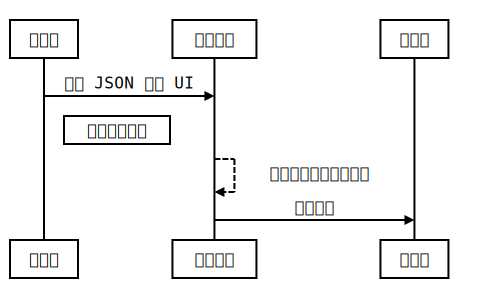

## 介绍

[Panel-Magic](https://github.com/Ricbet/panel-magic) 是一个基于 AngularX+ 并面向设计师或运营人员的可视化搭建平台，目前仅可用于快速生成微信小程序应用，具有与 Photoshop 相似的交互体验！！

> 好了，吹完之后接下来开始从技术角度剖析我在做这个搭建平台时和实现原理

在此之前说明该平台的定位，目的不是给技术人员编辑完之后进行二次开发或代码的定制化。关于这个定位问题我个人的想法是，code 问题不可能完全交托给可视化编辑、除非是类似传统的企业介绍页等还有可能完全代替，但还是比不上直接代码生成的工具，所以 Panel-Magic 一开始的定位就是给设计师或运营人员使用，生成的产物不再是 code。

## 技术栈

-   框架选型：Angular8
-   UI 组件库：[ng-zorro-antd](https://github.com/NG-ZORRO/ng-zorro-antd)(宇宙第一组件库)
-   本地存储：IndexedDB
-   响应式编程库：Rxjs
-   编写语言：Typescript
-   CSS 预处理器：SCSS
-   最终产物：JSON

## 工作流程



关键是中间的数据模型的建模过程以及可视化界面的创建，生成的新数据和源数据都是约定好固定格式的 JSON 描述文件，其包含固定的 key 字段和对应的 value 值类型，生成小程序的过程在生成完新数据之后

目前源数据约定的数据格式为

```JSON
{
    "app_id": "",
    "cata_data": [
        {
            "group": "默认组",
            "pages": [
                {
                    "title": "首页",
                    "name": "首页",
                    "router": "page10001",
                    "isEdit": false,
                    "uniqueId": 1556693791081,
                },
            ],
            "isEdit": false,
            "uniqueId": 1556693791066,
        }
    ]
    // more ...
}
```

更为完整的约定格式在 [MockModel.ts](https://github.com/Ricbet/panel-magic/blob/master/src/app/service/hs-xcx/MockModel.ts)

## 目录结构

```termianle
src
├── app
│   ├── appdata                                 // AppData 根服务，数据模型 AppDataModel 的核心服务
│   ├── base-class                              // 基类
│   ├── core                                    // HttpClient 服务
│   ├── panel-extend                            // 可视化搭建交互部分
│   │   ├── model                               // 数据模型
│   │   ├── panel-assist-arbor                  // 右侧可操作区域如对齐、图层、前进后退等操作入口
│   │   ├── panel-catalogue                     // 页面分组管理
│   │   ├── panel-event                         // 事件管理
│   │   ├── panel-layer                         // 图层列表管理
│   │   ├── panel-scaleplate                    // 标尺管理
│   │   ├── panel-scope-enchantment             // 核心拖拽部分，包括辅助线、轮廓描述等
│   │   ├── panel-senior-vessel-edit            // 容器组合管理
│   │   ├── panel-shell                         // “手机壳”区域管理
│   │   ├── panel-soul                          // 左侧组件库管理
│   │   ├── panel-widget                        // 每个部分组件如按钮、文字等
│   │   │   ├── all-widget-container
│   │   │   │   ├── auxiliaryline-widget
│   │   │   │   ├── button-widget
│   │   │   │   ├── linkrange-widget
│   │   │   │   ├── picture-widget
│   │   │   │   ├── rect-widget
│   │   │   │   └── text-widget
│   │   │   ├── all-widget-unit
│   │   │   │   ├── map-view
│   │   │   │   ├── navigation-bar-view
│   │   │   │   ├── rich-text-view
│   │   │   │   ├── slideshow-picture-view
│   │   │   │   └── tab-bar-view
│   │   │   ├── all-widget-vessel
│   │   │   │   └── senior-vessel-widget
│   │   │   └── model
│   │   ├── panel-widget-appearance             // “设置”管理
│   │   │   ├── model
│   │   │   ├── panel-widget-animation
│   │   │   ├── panel-widget-clip-path
│   │   │   ├── panel-widget-facade
│   │   │   ├── panel-widget-filter
│   │   │   ├── panel-widget-picture
│   │   │   ├── panel-widget-shadow
│   │   │   └── panel-widget-text
│   │   ├── panel-widget-appearance-site        // 每个部分组件的专属“设置”
│   │   │   ├── panel-button-site
│   │   │   ├── panel-combination-site
│   │   │   ├── panel-line-site
│   │   │   ├── panel-linkrange-site
│   │   │   ├── panel-map-site
│   │   │   ├── panel-picture-site
│   │   │   ├── panel-rect-site
│   │   │   ├── panel-slideshow-picture-site
│   │   │   └── panel-text-site
│   │   └── panel-widget-details                // 弹出来的“设置”管理界面
│   ├── public                                  // 公共组件
│   │   ├── directive
│   │   ├── image-gallery
│   │   ├── my-color-picker
│   │   ├── ng-thumb-auto
│   │   ├── pipe
│   │   ├── theme
│   │   ├── top-navbar
│   │   └── util
│   ├── service                                 // 服务端 service
│   │   ├── hs-files
│   │   └── hs-xcx
│   └── share
├── assets                                      // 资源文件
```

## 布局排版

为了实现更好的自由布局排版，在不考虑代码生成的情况下，绝对定位是我的首选选择，也更能适配像素级别的定制编辑

除了定位数据以外，每个组件其实都具有通用的样式数据，如边框设置、阴影设置、文本设置、定位设置等通用元素，甚至也具有通用的事件设置，然后对于编辑来说，组件同时也具有如选中时的轮廓样式数据等，所以我们定义一个基本组件数据模型，让所有组件都继承这个模型 [PanelWidgetModel.ts](https://github.com/Ricbet/panel-magic/blob/master/src/app/panel-extend/panel-widget/model/panel-widget.model.ts)

拿 button 按钮组件举例来说，它位于 `src/app/panel-extend/panel-widget/all-widget-container/button-widget`;

```
├── button-widget.component.html
├── button-widget.component.ts
└── button-widget.data.ts
```

> 其中 `button-widget.data.ts` 文件是用于在左侧拖拽组件到中间编辑区域时候的默认样式和事件数据，它是直接实例化了 PanelWidgetModel 并导出

其中 component 为；

```Typescript
import { Component, OnInit, Input } from "@angular/core";
import { PanelWidgetModel } from "../../model";

@Component({
    selector: "app-button-widget",
    templateUrl: "./button-widget.component.html",
    styles: [""],
})
export class ButtonWidgetComponent implements OnInit {
    private _widget: PanelWidgetModel;

    @Input()
    public get widget(): PanelWidgetModel {
        return this._widget;
    }
    public set widget(v: PanelWidgetModel) {
        this._widget = v;
    }
    constructor() {}

    ngOnInit() {}
}

```

然后在渲染的时候双向绑定里面的文本数据

```html
<p *ngIf="!widget.isHiddenText" class="text-overflow-hidden">{{ widget.autoWidget.content }}</p>
```

对于简单的组件 `PanelWidgetModel` 提供的基本数据模型足矣；

稍微复杂的组件如 `map` 地图组件则可以在 component 文件里自行拓展 PanelWidgetModel 类；

有了 `PanelWidgetModel` 之后，我们来看看渲染组件的核心代码部分 👇;

```html
<div class="zoom-area" [ngStyle]="{ 'background-color': panelInfo.bgColor }">
    <ng-container *ngFor="let widget of widgetList$ | async">
        <div class="widget-shell" [ngStyle]="widget.profileModel.styleContent">
            <app-panel-widget [widget]="widget" [isSimpleFunc]="false"></app-panel-widget>
        </div>
    </ng-container>
</div>
```

在模版中循环异步渲染 `widgetList$` 里的组件并传递数据给 app-panel-widget 组件;

其中 `widgetList$` 定义为;

```typescript
public get widgetList$(): BehaviorSubject<Array<PanelWidgetModel>> {
    return this.panelExtendService.widgetList$;
}

// 在 panelExtendService 服务里
public widgetList$: BehaviorSubject<Array<PanelWidgetModel>> = new BehaviorSubject<Array<PanelWidgetModel>>([]);
```

就是上述提到的 PanelWidgetModel 类列表；

而 app-panel-widget 组件位于 `src/app/panel-extend/panel-widget/panel-widget.component.ts`

它负责接收 `widgetList$` 里的每一个不同组件并根据 `type` 类型负责渲染对应的组件；

```html
<div
    class="widget-main"
    [nrIsStopPropagation]="true"
    nrDraggable
    [nrIdBody]="'#free-panel-main'"
    (launchMouseIncrement)="acceptDraggableIncrement($event)"
    nrMouseMoveOut
    (dblclick)="acceptDoubleClick()"
    (mousedown)="acceptWidgetChecked($event)"
    (emitMouseType)="acceptMouseMoveOut($event)"
    (contextmenu)="acceptWidgetRightClick($event)"
>
    <ng-container *ngIf="widget.autoWidget">
        <div class="widget-content {{ widget.type }}" *ngIf="widget.type != 'combination'" [ngStyle]="widgetStyle">
            <ng-container [ngSwitch]="widget.type">
                <!-- 文本 -->
                <ng-container *ngSwitchCase="'text'">
                    <app-text-widget [widget]="widget"></app-text-widget>
                </ng-container>
                <!-- 图片 -->
                <ng-container *ngSwitchCase="'picture'">
                    <app-picture-widget [widget]="widget"></app-picture-widget>
                </ng-container>
                <!-- 按钮 -->
                <ng-container *ngSwitchCase="'button'">
                    <app-button-widget [widget]="widget"></app-button-widget>
                </ng-container>
                <!-- 辅助线 -->
                <ng-container *ngSwitchCase="'line'">
                    <app-auxiliaryline-widget [widget]="widget"></app-auxiliaryline-widget>
                </ng-container>
                <!-- 矩形 -->
                <ng-container *ngSwitchCase="'rect'"></ng-container>
                <!-- 链接区域 -->
                <ng-container *ngSwitchCase="'linkrange'">
                    <app-linkrange-widget [widget]="widget"></app-linkrange-widget>
                </ng-container>
                <!-- 轮播图 -->
                <ng-container *ngSwitchCase="'slideshowpicture'">
                    <app-slideshow-picture-view [widget]="widget"></app-slideshow-picture-view>
                </ng-container>
                <!-- 富文本 -->
                <ng-container *ngSwitchCase="'richtext'">
                    <app-rich-text-view [autoWidget]="widget"></app-rich-text-view>
                </ng-container>
                <!-- 地图 -->
                <ng-container *ngSwitchCase="'map'">
                    <app-map-view [autoWidget]="widget"></app-map-view>
                </ng-container>
                <!-- 动态容器 -->
                <ng-container *ngSwitchCase="'seniorvessel'">
                    <div class="vessel-tip" *ngIf="isViseableVesselTip"><span>双击编辑动态容器</span></div>
                    <app-senior-vessel-widget [widget]="widget"></app-senior-vessel-widget>
                </ng-container>
            </ng-container>
        </div>
        <!-- 组合 -->
        <ng-container *ngIf="widget.type == 'combination'">
            <div class="combination-container" [ngStyle]="widgetStyle">
                <ng-container *ngFor="let list of widget.autoWidget.content">
                    <ng-container
                        *ngIf="list.type != 'combination' && (list.profileModel.combinationWidgetData$ | async)"
                    >
                        <div
                            class="widget-shell"
                            [ngStyle]="(list.profileModel.combinationWidgetData$ | async).styleContent"
                        >
                            <app-panel-widget [widget]="list" [isSimpleFunc]="true"></app-panel-widget>
                        </div>
                    </ng-container>
                </ng-container>
            </div>
        </ng-container>
    </ng-container>
</div>
```

我们继续看 app-panel-widget 组件的模版部分;

```html
<div
    class="widget-main"
    [nrIsStopPropagation]="true"
    nrDraggable
    [nrIdBody]="'#free-panel-main'"
    (launchMouseIncrement)="acceptDraggableIncrement($event)"
    nrMouseMoveOut
    (dblclick)="acceptDoubleClick()"
    (mousedown)="acceptWidgetChecked($event)"
    (emitMouseType)="acceptMouseMoveOut($event)"
    (contextmenu)="acceptWidgetRightClick($event)"
></div>
```

-   `nrDraggable`: 指定该组件是可拖拽组件
-   `launchMouseIncrement`: 由 public 里的 DraggableDirective 指令提供，用于返回鼠标事件的 movementY 和 movementX
-   `nrMouseMoveOut`: 由 public 里的 MousemoveoutDirective 指令提供，用于返回鼠标的移入和移出事件监听
-   `emitMouseType`: 由 public 里的 MousemoveoutDirective 指令提供，返回鼠标是移入还是移出事件
-   `contextmenu`: 右键事件

所以，当你在面板中选中某个组件的时候，不单单只是一个简单的 click 事件组成，是由鼠标的移入、鼠标按下、鼠标弹起等分解步骤来完成；

我们先看看 `mousedown` 事件, 它执行的方法为 `acceptWidgetChecked`；

```typescript
public acceptWidgetChecked(event: MouseEvent): void {
    if (!this.isSimpleFunc) {
        event.stopPropagation();
        event.preventDefault();
        if (
            !this.panelScopeEnchantmentService.scopeEnchantmentModel.outerSphereInsetWidgetList$.value.some(
                w => w.uniqueId == this.widget.uniqueId
            )
        ) {
            event.shiftKey == true
                ? this.panelScopeEnchantmentService.toggleOuterSphereInsetWidget(this.widget)
                : this.panelScopeEnchantmentService.onlyOuterSphereInsetWidget(this.widget);
        } else {
            if (event.shiftKey == true) this.panelScopeEnchantmentService.toggleOuterSphereInsetWidget(this.widget);
        }
        this.openMouseMoveLaunch();
    }
}
```

这里先补充一下，[`panelScopeEnchantmentService`](https://github.com/Ricbet/panel-magic/blob/master/src/app/panel-extend/panel-scope-enchantment/panel-scope-enchantment.service.ts) 服务负责管理拖拽时的辅助线计算、轮廓描边生成以及右键事件等核心编辑服务，该服务的 [`ScopeEnchantmentModel`](https://github.com/Ricbet/panel-magic/blob/master/src/app/panel-extend/panel-scope-enchantment/model/scope-enchantment.model.ts) 就是用于生成组件轮廓数据和拖拽点的数据模型类；

> 所谓'轮廓描述'，就是计算多个或单个组件的最长、最高的描边

回到 `acceptWidgetChecked`, 这里当鼠标按下的时候并不是直接生成该组件的轮廓描述，而是多了 `shiftKey` 键盘事件的判断，用于按住 `shiftKey` 的时候多选多个组件并将生成的轮廓描边包含出多个组件，如


其中生成轮廓的逻辑核心部分在 `panelScopeEnchantmentService` 里的 `handleFromWidgetListToProfileOuterSphere` 方法,👇

```typescript
public handleFromWidgetListToProfileOuterSphere(arg: { isLaunch?: boolean } = { isLaunch: true }): void {
    const oriArr = this.scopeEnchantmentModel.outerSphereInsetWidgetList$.value.map(e => {
        e.profileModel.isCheck = true;
        // 根据当前位置重新设置mousecoord
        e.profileModel.setMouseCoord([e.profileModel.left, e.profileModel.top]);
        return e.profileModel;
    });
    if (oriArr.length > 0) {
        // 计算出最小的left,最小的top，最大的width和height
        const calcResult = this.calcProfileOuterSphereInfo();
        // 如果insetWidget数量大于一个则不允许开启旋转,且旋转角度重置
        if (oriArr.length == 1) {
            calcResult.isRotate = true;
            calcResult.rotate = oriArr[0].rotate;
        } else {
            calcResult.isRotate = false;
        }
        // 赋值
        this.scopeEnchantmentModel.launchProfileOuterSphere(calcResult, arg.isLaunch);
        // 同时生成八个方位坐标点，如果被选组件大于一个则不生成
        this.scopeEnchantmentModel.handleCreateErightCornerPin();
    }
}
```

其中 `calcProfileOuterSphereInfo` 是计算大小和位置的核心

```typescript
public calcProfileOuterSphereInfo(): OuterSphereHasAuxlModel {
    const insetWidget = this.scopeEnchantmentModel.outerSphereInsetWidgetList$.value;
    let outerSphere = new OuterSphereHasAuxlModel().setData({
        left: Infinity,
        top: Infinity,
        width: -Infinity,
        height: -Infinity,
        rotate: 0,
    });
    let maxWidth = null;
    let maxHeight = null;
    let minWidthEmpty = Infinity;
    let minHeightEmpty = Infinity;
    insetWidget.forEach(e => {
        let offsetCoord = { left: 0, top: 0 };
        if (e.profileModel.rotate != 0 && insetWidget.length > 1) {
            offsetCoord = this.handleOuterSphereRotateOffsetCoord(e.profileModel);
        }

        outerSphere.left = Math.min(outerSphere.left, e.profileModel.left + offsetCoord.left);
        outerSphere.top = Math.min(outerSphere.top, e.profileModel.top + offsetCoord.top);

        maxWidth = Math.max(maxWidth, e.profileModel.left + e.profileModel.width + offsetCoord.left * -1);
        maxHeight = Math.max(maxHeight, e.profileModel.top + e.profileModel.height + offsetCoord.top * -1);

        if (e.profileModel.left + e.profileModel.width < 0) {
            minWidthEmpty = Math.min(minWidthEmpty, Math.abs(e.profileModel.left) - e.profileModel.width);
        } else {
            minWidthEmpty = 0;
        }

        if (e.profileModel.top + e.profileModel.height < 0) {
            minHeightEmpty = Math.min(minHeightEmpty, Math.abs(e.profileModel.top) - e.profileModel.height);
        } else {
            minHeightEmpty = 0;
        }
    });

    outerSphere.width = Math.abs(maxWidth - outerSphere.left) - minWidthEmpty;
    outerSphere.height = Math.abs(maxHeight - outerSphere.top) - minHeightEmpty;
    outerSphere.setMouseCoord([outerSphere.left, outerSphere.top]);

    return outerSphere;
}
```

更为完整的逻辑在 `panelScopeEnchantmentService` 服务里；

接下来就是拖拽事件，拖拽的组件并不单单是某个组件，而是轮廓包含在内的所有被选中组件，核心代码在 `src/app/panel-extend/panel-scope-enchantment/model/scope-enchantment.model.ts` 的 `handleLocationInsetWidget` 方法里；

```typescript
/**
 * 根据主轮廓的位置计算轮廓内被选组件的位置
 */
public handleLocationInsetWidget(
    increment: DraggablePort,
    allWidget: Array<PanelWidgetModel> = this.outerSphereInsetWidgetList$.value
): void {
    if (Array.isArray(allWidget)) {
        const pro = this.valueProfileOuterSphere;
        // 所有轮廓内的组件计算位置
        allWidget.forEach(w => {
            w.profileModel.mouseCoord[0] += increment.left;
            w.profileModel.mouseCoord[1] += increment.top;
            let obj = { left: w.profileModel.mouseCoord[0], top: w.profileModel.mouseCoord[1] };
            if (!(pro.lLine || pro.rLine || pro.vcLine)) {
                obj.left = w.profileModel.mouseCoord[0];
                pro.left = pro.mouseCoord[0];
            } else {
                obj.left += pro.left - pro.mouseCoord[0];
            }
            if (!(pro.tLine || pro.bLine || pro.hcLine)) {
                obj.top = w.profileModel.mouseCoord[1];
                pro.top = pro.mouseCoord[1];
            } else {
                obj.top += pro.top - pro.mouseCoord[1];
            }
            w.profileModel.setData(obj);
            /**
             * 如果被选的所有组件当中有组合组件combination，则需要重新计算其子集的所有widget轮廓数值
             */
            if (w.type == "combination") {
                this.handleLocationInsetWidget(increment, w.autoWidget.content);
            }
        });
    }
}
```

注：由于拖拽的过程当中，改变的是每个组件自身的位置信息数据，而轮廓描述是由 `calcProfileOuterSphereInfo` 计算生成的，所有在拖拽的过程当中还需要实时计算主轮廓描述的数据；

小结：组件的布局排版依赖于 `PanelWidgetModel` 数据模型类, 单选和多选并一起拖拽依赖于 `ScopeEnchantmentModel` 数据模型类，还有其他的细节实现这里就不一一阐述

## 对齐辅助线生成规则 ##

先看看对齐辅助线效果;


用过 PS 的蛇鸡丝应该对这个功能不会陌生，我个人也很喜欢这么牛逼的辅助线对齐；

我们先看看对齐辅助线渲染的模版文件，它位于 `src/app/panel-extend/panel-scope-enchantment/panel-scope-enchantment.component.html`；

```html
<!-- 辅助线 -->
<div class="auxiliary-container">
    <ng-container *ngIf="scopeEnchantment.profileOuterSphere$ | async">
        <div
            class="v v-left"
            *ngIf="(scopeEnchantment.profileOuterSphere$ | async).lLine"
            [ngStyle]="{
                left:
                    (scopeEnchantment.profileOuterSphere$ | async).left +
                    (scopeEnchantment.profileOuterSphere$ | async).offsetAmount.left +
                    'px'
            }"
        ></div>
        <div
            class="v v-center"
            *ngIf="(scopeEnchantment.profileOuterSphere$ | async).vcLine"
            [ngStyle]="{ left: (scopeEnchantment.profileOuterSphere$ | async).vCenterStyle + 'px' }"
        ></div>
        <div
            class="v v-right"
            *ngIf="(scopeEnchantment.profileOuterSphere$ | async).rLine"
            [ngStyle]="{
                left:
                    (scopeEnchantment.profileOuterSphere$ | async).rightStyle -
                    (scopeEnchantment.profileOuterSphere$ | async).offsetAmount.left +
                    'px'
            }"
        ></div>
        <div
            class="h h-top"
            *ngIf="(scopeEnchantment.profileOuterSphere$ | async).tLine"
            [ngStyle]="{
                top:
                    (scopeEnchantment.profileOuterSphere$ | async).top +
                    (scopeEnchantment.profileOuterSphere$ | async).offsetAmount.top +
                    'px'
            }"
        ></div>
        <div
            class="h h-center"
            *ngIf="(scopeEnchantment.profileOuterSphere$ | async).hcLine"
            [ngStyle]="{ top: (scopeEnchantment.profileOuterSphere$ | async).hCenterStyle + 'px' }"
        ></div>
        <div
            class="h h-bottom"
            *ngIf="(scopeEnchantment.profileOuterSphere$ | async).bLine"
            [ngStyle]="{
                top:
                    (scopeEnchantment.profileOuterSphere$ | async).bottomStyle -
                    (scopeEnchantment.profileOuterSphere$ | async).offsetAmount.top +
                    'px'
            }"
        ></div>
    </ng-container>
</div>
```

> ps: 辅助线的计算生成规则会遇到旋转角度变化的影响，解决这个影响可以看我另一篇水文 [12.拖拽拉伸加上旋转角度的数学原理](https://github.com/Ricbet/blog/blob/master/src/article/12.%E6%8B%96%E6%8B%BD%E6%8B%89%E4%BC%B8%E5%8A%A0%E4%B8%8A%E6%97%8B%E8%BD%AC%E8%A7%92%E5%BA%A6%E7%9A%84%E6%95%B0%E5%AD%A6%E5%8E%9F%E7%90%86.md)

可见辅助线依赖于 `ScopeEnchantmentModel` 里的 `profileOuterSphere$`, 定义如下;

```typescript
public profileOuterSphere$: BehaviorSubject<OuterSphereHasAuxlModel> = new BehaviorSubject(null);
```


## 组合组件和旋转拉伸 ##

## 前进和后退 ##

## 剪贴蒙版 ##

## 动态容器 ##

## 关于如何生成小程序 ##
