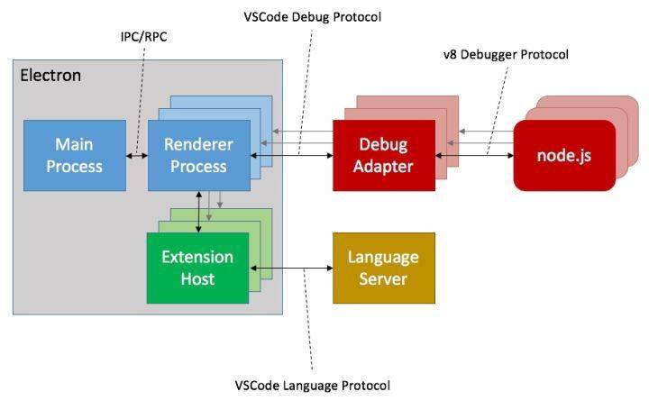

# 简单介绍 #

Visual Studio Code (简称: VS Code) 是微软开发的一款跨平台、轻量级的代码编辑器，它丰富的插件生态和良好的性能获得了很多开发者的青睐，本文从整体的架构体系出发到细致的工程化亮点来讲讲 VS Code 的内部是怎样运行的。

首先需要了解的是 VS Code 是基于 Electron 的，而 Electron 是基于 Chromium 和 Node.js 的项目，所以采用 HTML 来展示 UI，采用 Node.js 来访问文件系统等。同时整体代码采用 Typescript 编写。为了追求极致的性能优化并没有采用任何的框架或库来实现 UI，而是采用纯 DOM 的操作方式。编辑的部分则是采用 Monaco Editor

---

- [技术架构](#技术架构)
- [启动流程 - 从 Workbench 开始](#启动流程\ -\ 从\ Workbench\ 开始)
- [资源加载方式 - AMD loader](#资源加载方式\ -\ AMD\ loader)
- [语言的高亮是咋回事](#语言的高亮是咋回事)
- [依赖注入的实现](#依赖注入的实现)
- [插件是如何跑起来的](#插件是如何跑起来的)
- [LSP 和 DAP](#LSP\ 和\ DAP)
- [搜索为何这么快](#搜索为何这么快)
- [大文本文件如何保证性能](#大文本文件如何保证性能)
- [浅谈如何为其提供云端 WEB 版支持](#浅谈如何为其提供云端\ WEB\ 版支持)

---

# 技术架构 #

因为是基于 Electron 的应用，所以采用的仍然是多进程架构。\
由主进程掌管着窗口创建、ipc 服务、环境变量服务等全局任务。\
由渲染进程去加载 Web 页面。



主进程与渲染进程之间采用 IPC 或 RPC 进行通信，其中渲染进程还会有单独的 Extension Host 进程负责掌管所有的插件进程，包括语言服务。

简单概括就是 VS Code 本身仅提供性能良好的文本编辑体验和文件树、面板等 UI 操作。具体的语言服务和调试功能均通过插件的形式开放给第三方（或自己），并采用 LSP 和 DAP 两种标准化协议来进行 JSON RPC 通信。保证了在进行语义分析的时候不占用主进程的大量 CPU 和内存。

其中内置了一些常用的功能插件和语法高亮、简单的代码片段插件等，如 Git、Docker、包含几乎所有语言的高亮显示和部分代码片段、主题插件等
当然也内置了 TypeScript 和 JavaScript 的语言服务插件

> 文中涉及到的 VS Code 代码部分均是 1.39.2 版本

---

# 启动流程 - 从 Workbench 开始 #

`Electron` 应用的启动文件目录是配置在了 package.json 的 main 字段里，VS Code 也不例外

```json
"main": "./out/main"
```

其中 `out` 目录是编译后的产物，`main` 文件对应编译前的路径是 `src/main.js`

我们先看他做了哪些事

```js

/**
 * 注：这里的 bootstrap 并不是前端的那个库。
 * 而是封装的一些读取文件操作和启动工作工具，理解成 utils 也行
 * 
 * 而 configurePortable 方法则是根据 env 里的环境变量配置和外层的 product.json 文件获取或创建不同平台下的根路径，便于移植
 */
const portable = bootstrap.configurePortable();

// ---

/**
 * 根据环境变量或不同平台设置 node 进程的工作目录
 */
setCurrentWorkingDirectory();

// ---

/**
 * 里面核心部分就是在 Mac OS 平台下将文件直接拖拽到 VS Code 图标的时候自动打开并设置为当前的工作空间目录
 */
registerListeners();

// ---

/**
 * 关于多语言 NLS 的配置读取
 * `getUserDefinedLocale` 函数其实是读取用户目录下的 locale.json 配置文件，检查是哪种多语言，但因为 amd loader 是区分大小写的，所以单独写了个方法读取
 * 
 * 所以当你下载中文插件并通过 cmd+shift+p config 选择 zh-cn 的时候就是写在了这个文件，这也是为什么在切换多语言的时候需要重启的间接原因
 * 
 * `nls.metadata.json` 文件是编译后的产物了
 * 
 */
let nlsConfiguration = undefined;
const userDefinedLocale = getUserDefinedLocale();
const metaDataFile = path.join(__dirname, 'nls.metadata.json');

userDefinedLocale.then(locale => {
	if (locale && !nlsConfiguration) {
		nlsConfiguration = lp.getNLSConfiguration(product.commit, userDataPath, metaDataFile, locale);
	}
});

// ---

/**
 * 前面简单配置环境变量之后开始监听 electron 的 ready
 * 其中 trace 参数是用于开发调试 VS Code 的时候跟踪日志的
 */
app.once('ready', function () {
	if (args['trace']) {
		// @ts-ignore
		const contentTracing = require('electron').contentTracing;

		const traceOptions = {
			categoryFilter: args['trace-category-filter'] || '*',
			traceOptions: args['trace-options'] || 'record-until-full,enable-sampling'
		};

		contentTracing.startRecording(traceOptions, () => onReady());
	} else {
		onReady();
	}
});

// ---

/**
 * 中间的配置相关代码忽略
 * 从这里开始就是通过 AMD 加载的方式直接加载到 electron-main/main 文件
 */
const startup = nlsConfig => {
    // ---
    require('./bootstrap-amd').load('vs/code/electron-main/main', () => {
        perf.mark('didLoadMainBundle');
    });
};

```

> 这里的 main.js 的作用就是负责加载 nls 配置和 load `vs/code/electron-main/main` 文件

下面我们看主要的 `electron-main/main` 文件

```typescript

/**
 * 先是直接实例化了 CodeMain 并调用 startup 方法 
 */

private async startup(args: ParsedArgs): Promise<void> {
    // ---
    /**
     *  这里涉及到 VS Code 自己实现的依赖注入，后面会讲到，仅需了解这是在创建相关服务即可
     */
    const [instantiationService, instanceEnvironment] = this.createServices(args, bufferLogService);

    // ---

    /**
     * 当前面的一些环境变量服务、日志服务、生命周期服务等依赖关系创建好之后便开始主进程的 IPC Server 创建
     */
    const mainIpcServer = await this.doStartup(logService, environmentService, lifecycleMainService, instantiationService, true);

    // ---
    
    /**
     * 最后创建 CodeApplication 实例并把 mainIpcServer 和 instanceEnvironment 作为 CodeApplication 参数传递进去
     */
    return instantiationService.createInstance(CodeApplication, mainIpcServer, instanceEnvironment).startup();

}

```

> 这里 `electron-main/main` 还是没有直接创建窗口，主要还是进行一些服务的注入构造和创建主进程的 node ipc 服务器

来到 `CodeApplication`

```typescript
// ---

/**
 * 首先 CodeApplication 会先被实例化，所以先执行 registerListeners 方法
 * 
 * 这里面就是注册 Electron 的一些事件监听，如 open-file、vscode:exit 等
 */
this.registerListeners();

// ---

async startup(): Promise<void> {
    // ---
    /**
     * 先是创建了共享进程，并在生命周期服务里把环境变量参数传递进去
     */
    const sharedProcess = this.instantiationService.createInstance(SharedProcess, machineId, this.userEnv);

    // ---
    /**
     * 然后就是熟悉的创建各种各样的依赖注入项服务了
     */ 
    const appInstantiationService = await this.createServices(machineId, trueMachineId, sharedProcess, sharedProcessClient);

    // --
    /**
     * 然后就开始 `准备` 创建 window 窗口
     */
    const windows = appInstantiationService.invokeFunction(accessor => this.openFirstWindow(accessor, electronIpcServer, sharedProcessClient));
}

// ---

private openFirstWindow(accessor: ServicesAccessor, electronIpcServer: ElectronIPCServer, sharedProcessClient: Promise<Client<string>>): ICodeWindow[] {
    // ---
    /**
     * 前面就是注册 ipc 频道
     * 包括 debug
     */
    // --- 
    /**
     * 中间的流程处理暂不阐述，最终主要是根据不同平台调用了 windowsMainService 服务的 open 方法
     */
    windowsMainService.open({...});
}

```

而 `open` 里就是处理各种多开情况、两文件 diff 情况、以及重启窗口等情况，最终会通过 `doOpen` 方法来根据参数打开

而 `doOpen` 里又是一些边际情况逻辑处理，最终会调用到 `doOpenInBrowserWindow` 方法

而 `doOpenInBrowserWindow` 里会先去备份数据到 backupMainService 服务里，执行 `CodeWindow` 的 `load` 方法

而 `CodeWindow` 里的 `load` 方法, 最最最终会指向到一个 `html` 文件并加载

```ts
private doGetUrl(config: object): string {
    return `${require.toUrl('vs/code/electron-browser/workbench/workbench.html')}?config=${encodeURIComponent(JSON.stringify(config))}`;
}
```

这个 `html` 主要就是负责通过 script 标签加载 `workbench.js` 文件

然后里面则是采用 `vscode-loader` 来加载 **vs/workbench/workbench.desktop.main**, **vs/nls!vs/workbench/workbench.desktop.main**, **vs/css!vs/workbench/workbench.desktop.main** 这三个文件，最终会开始进行 DOM 的绘制

位于 `src/vs/workbench/electron-browser/desktop.main.ts`
```ts
export function main(configuration: IWindowConfiguration): Promise<void> {
	const renderer = new DesktopMain(configuration);

	return renderer.open();
}
```

然后就开始进行布局 layout 、键盘事件创建、文件树的 DOM 创建等
```ts
[
    { id: Parts.TITLEBAR_PART, role: 'contentinfo', classes: ['titlebar'] },
    { id: Parts.ACTIVITYBAR_PART, role: 'navigation', classes: ['activitybar', this.state.sideBar.position === Position.LEFT ? 'left' : 'right'] },
    { id: Parts.SIDEBAR_PART, role: 'complementary', classes: ['sidebar', this.state.sideBar.position === Position.LEFT ? 'left' : 'right'] },
    { id: Parts.EDITOR_PART, role: 'main', classes: ['editor'], options: { restorePreviousState: this.state.editor.restoreEditors } },
    { id: Parts.PANEL_PART, role: 'complementary', classes: ['panel', this.state.panel.position === Position.BOTTOM ? 'bottom' : 'right'] },
    { id: Parts.STATUSBAR_PART, role: 'contentinfo', classes: ['statusbar'] }
].forEach(({ id, role, classes, options }) => {
    const partContainer = this.createPart(id, role, classes);

    this.getPart(id).create(partContainer, options);
});
```

总体来说还是很易懂的，从主进程 IPC 服务器创建、读取环境变量配置、各种状态逻辑处理、共享进程的创建、注册 IPC 通道等等预备操作，到最后的 DOM 绘制流程都还是一条很清晰的流程线的。

---

# 资源加载方式 - AMD loader #

然后就是 VS Code 的文件加载机制了


---

# 语言的高亮是咋回事 #

---

# 依赖注入的实现 #

---

# 插件是如何跑起来的 #

---

# LSP 和 DAP #

---

# 搜索为何这么快 #

---

# 大文本文件如何保证性能 #

---

# 浅谈如何为其提供云端 WEB 版支持 #