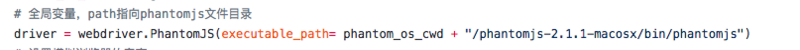
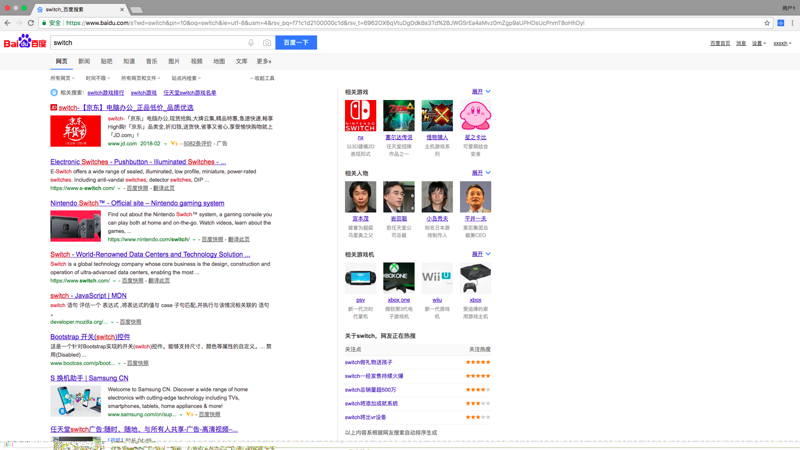
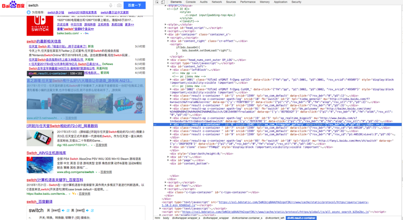
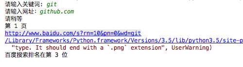
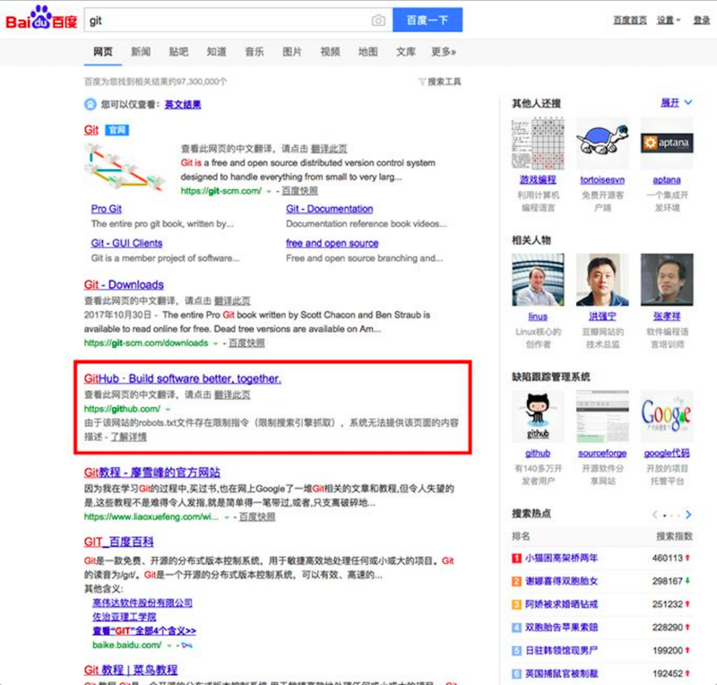
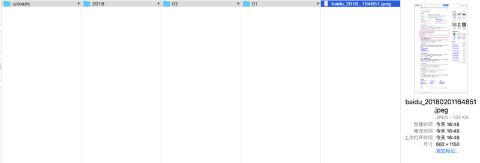

## 前言 ##

项目地址 [https://github.com/Ricbet/rank-screenshots][1]

该程序正常运行所需要的插件为[phantomjs][2]，建议下载mac版本，然后将下载的整个文件夹放在和.py文件同一级的目录下，若是window系统的话则修改程序中的

driver指向的插件目录名称

## 实现原理 ##
百度的搜索排名它选录的都是你所检索的关键词以及目标网址在第几个结果列表当中，但其中并不包括带“广告”标示的结果，例如


我搜素switch的时候我想知道Nintendo的官网在百度排名中属于第几名，图所示的例子中我在第二页里找到了任天堂的官网nintendo.com，所以switch这个关键词对于任天堂来说在百度的搜索排名是第十二名

我要做的就是根据关键词搜索模拟一次搜索，然后在搜索的结果集当中找到目标网址，匹配之后我再利用phantomjs截取屏幕并在关键的地方给予红框标注，然后再将该截图保存到本地目录当中

首先我们还是得先了解下百度搜索的一些常用参数
pn： 表示从第pn条结果开始显示
rn： 表示每一页要显示多少条结果，默认10条
wd： 表示要搜索的词
其实我们只需要这三个参数就足够了

## 模拟搜索 ##
首先先记录要请求的url，使用`quote`处理带中文的url

```python
r_url = 'http://www.baidu.com/s?rn=%s' % rn + '&pn=%s'%((pn_baidu-1)*rn) + "&wd=%s" % wd
r_url = quote(r_url, safe=string.printable)
```
然后我们用BeautifulSoup提取网页的文本内容

```python
with requests.get('http://www.baidu.com/s', params={'wd': wd, 'pn': (pn_baidu-1)*rn, 'rn': rn}, timeout=7) as r:
    soup = BeautifulSoup(r.text, 'html.parser')
```
我们观察百度的搜索结果列表页的html结构



发现这些结果集都被包含在了`content_left`这个id里面，然后只有`result`这个类的标签才是真正搜索出来的结果，其他的`result-op`这个类的标签并不算在排名中，因为这是那些最新相关信息呀、贴吧等

```python
p = re.compile(r'^result')
contentItem = soup.find(id="content_left").find_all('div', p)
```

`contentItem`就是我们列出的所有算在排名内的结果集列表
然后我们通过`for`循环遍历正则匹配我们输入的网址，看看在哪个下标的结果里面，就是当前的排名

```python
for index, list in enumerate(contentItem):
    _list = ''.join(re.split(r'\s+', list.get_text()))
    # 如果匹配成功
    if str.search(_list):
    # xxxxx
```

如果找到匹配的结果集了，此时就是`PhantomJS`派上用场的时候了

## 保存为截图并标注 ##

`python`的`PhantomJS`用法可以在谷某或者某度里面查得到，这里就不一一阐述了

我们通过观察到每一个`result`类的标签都有一个数字`id`，然后我们只要用`js`的方法获取这个`id`然后给它设置红框的样式就可以了

```python
driver.execute_script("""
                      (function(){
                          var result = document.getElementById(%s)
                          result.setAttribute('style','border:5px solid red;padding:10px;margin-left:-15px')
                      })()
                      """ %((index + 1)+((pn_baidu-1)*rn)))
```

同时根据时间戳来命名图片名称

```python
out_img_name = 'baidu_' + time_now_rub + ".jpeg"
driver.save_screenshot(out_img_name)
```

同时为了减少图片的资源大小，我们用`PIL`进一步处理图片，并保存为`jpeg`的格式

```python
# 打开图片
im = Image.open(out_img_name)
# 获取生成的图片宽度和高度
w, h = im.size
# 等比例压缩图片
im.thumbnail((int(w / 1.5), int(h / 1.5)), Image.ANTIALIAS)
# 保存
im.convert('RGB').save(out_img_name, 'JPEG', quality=80)
```

最后一步我们就是把生成的图片放在一个目录里面了

```
def findDirectory( img_name ):
    # 查询目录，如果没有就创建目录
    src_item = ['public','uploads',time_year,time_month,time_day,'']
    join_src_item = '/'.join(src_item[0:-1])+'/'
    # 判断当前目录文件是否有uploads
    if( os.path.exists(join_src_item) == False ):
        os.makedirs(join_src_item)
        shutil.move(img_name, join_src_item)
    else:
        shutil.move(img_name, join_src_item)
```

## 测试 ##




截图



目录结构




大致思路就是这样子


  [1]: https://github.com/Ricbet/rank-screenshots
  [2]: http://phantomjs.org/download.html